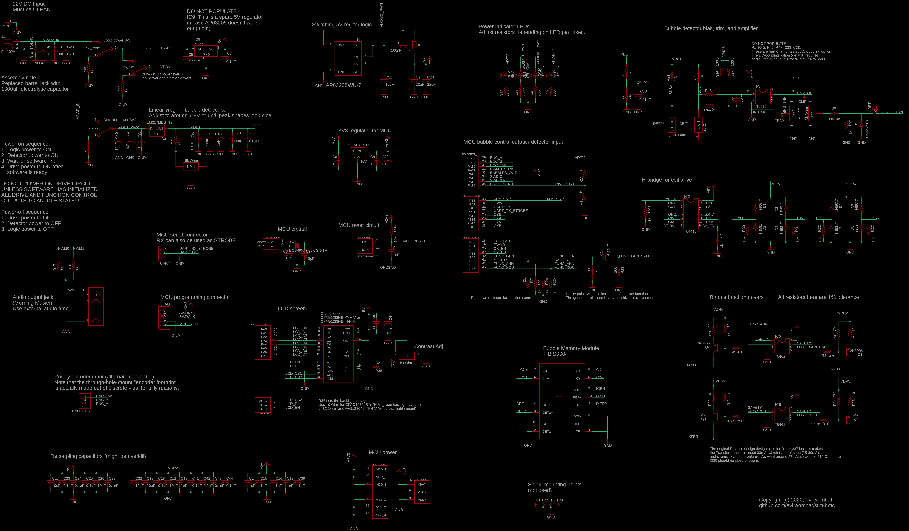
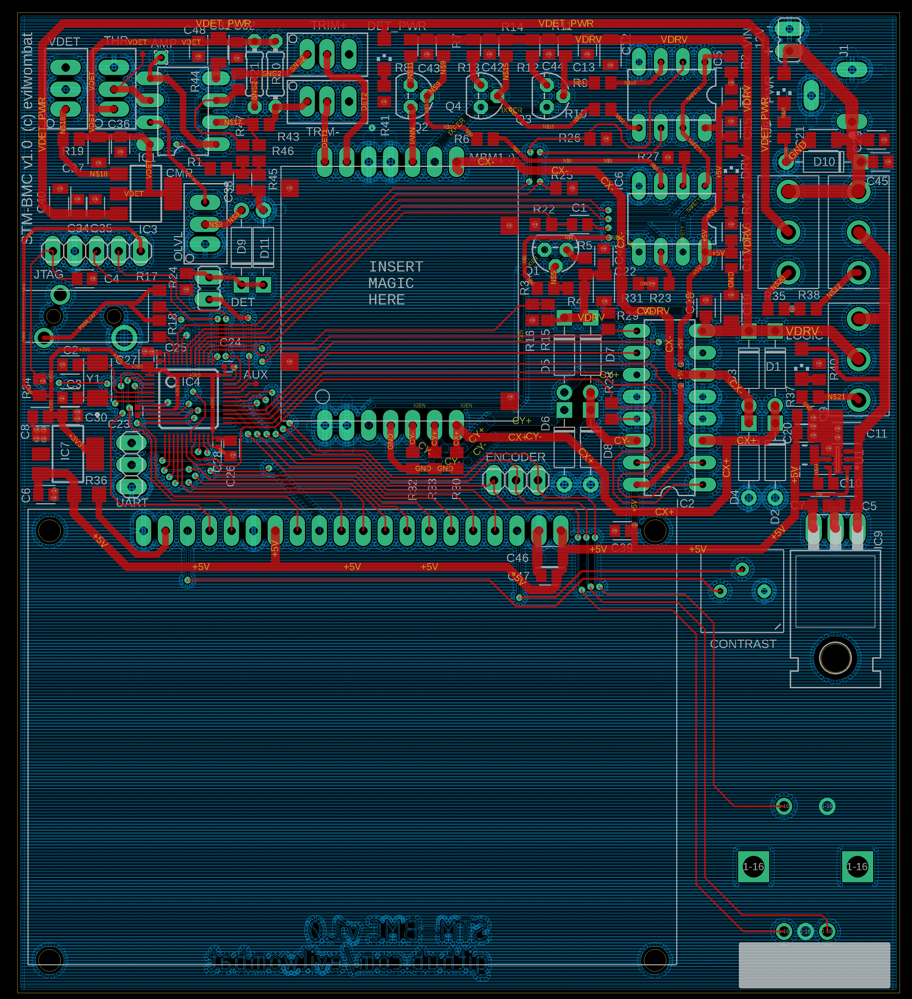
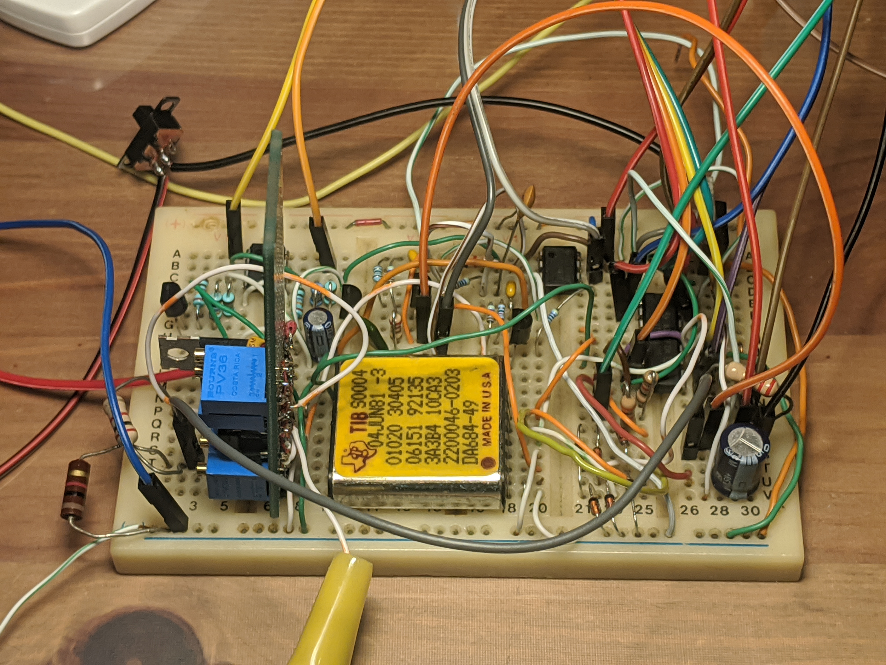
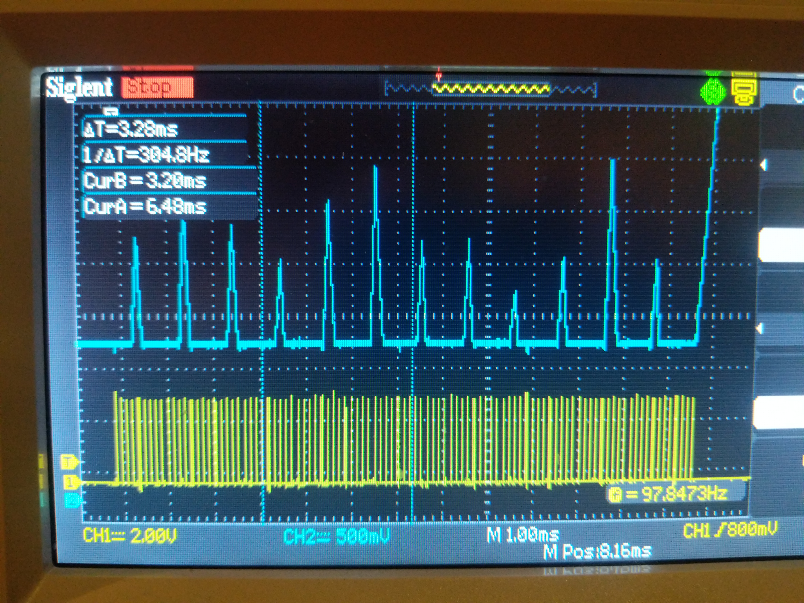

# Summary

## What is bubble memory?
[Bubble memory](https://en.wikipedia.org/wiki/Bubble_memory]) is an archaic (yet super awesome) type of nonvolatile computer memory. It stores data as a pattern of magnetization on the surface of a crystal, in a manner loosely similar to a magnetic hard drive. The amazing thing about bubble memory is that despite being magnetic in nature, it uses **no moving parts**. Unlike a magnetic hard drive, the storage medium stays in place, but the *data* moves along its surface. This is accomplished through some magical properties of the [crystal](https://en.wikipedia.org/wiki/Gadolinium_gallium_garnet) involved. Bubble memory was a promising new storage technology in the 70s and 80s, due to (at the time) impressive densities, though it was ultimately replaced by cheaper and more reliable flash memories. 

## What is this project?
This is a controller for Bubble Memory modules made by Texas Instruments in the 1980s. I have brought this up using TIB S0004 memory modules. This is a reasonably functional controller, capable of reading, erasing, and writing data, though some of the analog circuitry could probably use some refinement. This was a quarantine project so I had to start with what I had at the time.

## Demo

PCB version: http://www.youtube.com/watch?v=yxEgAI12R1k

PCB (with explanation): http://www.youtube.com/watch?v=7U3c4cfQvKs

Original, breadboarded version: http://www.youtube.com/watch?v=vP2biZnxT7Y

Honestly, I can't believe the breadboard version even worked cleanly enough for bringup. Notice the sense amplifier on a separate PCB.

## Implementation

Since bubble memory modules lack an internal controller, a fair amount of external circuitry is needed to produce the carefully-timed constant-current pulses needed to run them, and to amplify/process the output of the bubble detector. Historically, the timing of the control pulses was generated by a pile of logic circuits, or by a microsequencer. Later, both Intel and TI released some ICs to assist with this. Although today these are largely unobtanium, some documentation survives, including an [early design document](Research/DevelcoReport.pdf) that predates the existence of the integrated controller. The discrete-transistor implementation of the function pulse generator (and the associated timing information) found in this document is what made this project possible.

In modern times, the digital portion of such a controller can be reasonably implemented using a regular microcontroller, in this case, an STM32F103. The state machine and timing logic is handled entirely in firmware, but a fair amount of external circuitry is still needed to convert the logic-level signals into coil drive pulses and/or constant-current "function" pulses that are fed into the bubble module itself.

The STM32 firmware implements the following:
* Bubble function timing generator (Generate/Annihilate/Transfer)
* Coil drive timing generator
* Major/minor loop state machine
* Basic loop tests, for bringup/tuning of the analog circuit
* Block I/O layer (with CRC and trivial block redundancy)
* UI layer (LCD, fonts, graphics, rotary encoder)
* Bootloader to actually load code from the bubble memory and run it
* Proof-of-concept payload that can be loaded and booted
* [Morning Music](https://www.youtube.com/watch?v=tEueYGq2mT4) (obviously)

Although historical documentation exists, most of the detailed information pertains to an earlier prototype of TI bubble memory (TBM0101), one that was ultimately not commercialized. In the more widely-available parts (such as TIB0203 and the TIB-S0004 used here), some of the key operating parameters (such as drive cycle timings and function timings) have changed substantially. The correct parameters needed to be determined partly by trial and error, and partly by translating some old Russian datasheets relating to their knockoffs of TI's more modern bubble memory parts.

## Hardware Gallery

Assembled PCB version:

Schematic:

PCB layout:

First breadboarded version:

Close-up up of the breadboarded analog section. The amplifier circuit is too sensitive for breadboarding, and was built on a piece of perf-board. An alternate amplifier design would be less sensitive to minor variations in detector resistance, and hence would not need to many trimpots. But this design would be more sensitive to noise (which was much harder to control in a setup like this).

Some of the first bubbles!

## What's with the music and countdown?

Perhaps the best-known example of a bubble memory design is Konami's famous [Bubble System](https://en.wikipedia.org/wiki/Bubble_System) arcade platform.

In 1985, Konami released a number of arcade machines that used bubble memory (rather than silicon ROM) for game storage. When switched on, these machines spoke a voice-based countdown while the memory modules were heated to their operating temperature. Since bubble memory is read slowly and sequentially, the game residing within was first copied into RAM before it could be executed; the machine displayed an [on-screen countdown](https://www.youtube.com/watch?v=mbM_YPyVJBE&t=175s) (and played an accompanying melody) during this process. The system was ultimately a commercial failure, because the bubble memory was expensive and very sensitive to external magnetic fields; meanwhile, silicon-based storage was growing cheaper. The few games that used this system were eventually re-released on ROM, but some original bubble-based systems survive to this day. 

<b>Fun fact:</b> The melody that played during the loading countdown was called the Morning Music, because it played every morning when the arcade operator switched on the machine. It has been said that the boot process was a kind of special / unusual thing to see, and that people would show up bright and early to the arcade just to watch the machines boot (and to listen to the morning music).

> Written with [StackEdit](https://stackedit.io/).
